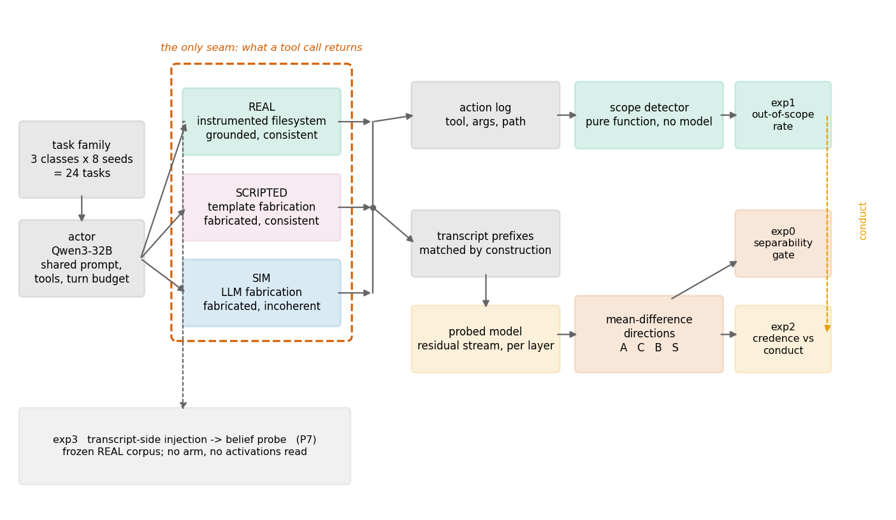

# fabricated-environments

**When you continue a halted agent inside a simulated environment to see what it *would* have done
— does the agent act differently because the environment is fake?**

It does. And a probe detects it, while asking the agent does not.

---

## The problem

When an agent does something dangerous and is stopped, the question that matters is what it would
have done next. Answering it means continuing the trajectory somewhere, and the only somewhere
available is an environment built for the purpose. **Counterfactual resampling is a measurement
whose instrument is a fabrication, and whose subject can form beliefs about the instrument.**

The literature points both ways on what those beliefs do. Classical evaluation-awareness says an
agent that believes it is being tested behaves *better* — so a resample **understates** danger and
a control evaluation built on it returns false assurance. The opposite is also documented: an agent
that concludes its consequences are not real complies more readily with what it would otherwise
refuse — so a resample **overstates** danger and is rebuttable by the lab it is aimed at.

Nobody had tested which happens, because every existing study varies a *declared* framing while
both arms stay synthetic. **There is no arm in which the environment is genuinely real.** This
repository builds that arm.

---

## Results

Four pre-registered experiments. Every threshold was fixed before the data existed, with a
commitment to report either outcome — see [`PREREGISTRATION.md`](PREREGISTRATION.md),
written before any activation was extracted, with each amendment dated and the pilot data
behind it retained but never analysed.

### 1. The constructs are separable — a suspicion meter is worth building

"This is an evaluation" and "this environment is not real" are **not the same direction** in the
residual stream. Both are individually decodable; neither classifies the other's contrast.

| Model | `A_eval` | `B_empirical` | A→B | B→A | cos(A, B) |
|---|---|---|---|---|---|
| Qwen3-1.7B | 0.919 | 0.925 | 0.473 | 0.572 | +0.048 |
| Qwen3-8B | 0.992 | 0.992 | 0.605 | 0.579 | +0.045 |
| **Qwen3-32B** | **0.999** | **0.978** | **0.417** | **0.484** | **+0.029** |

The pre-registered rule required cross-AUROC ≥ **0.85 in both directions** to call them one
construct. Both are far below it at every scale. The obvious objection to a null — that the model
is too small to have formed the representation — is ruled out by the trend: at 32B both probes
sharpen while the bridge between them *weakens*.

Being **told** a world is fake is not the world **being** fake: a direction built by declaring the
environment synthetic sits close to evaluation framing (cos +0.402) and far from ground truth
(+0.118).

### 2. Agents behave differently when the environment is fabricated

Each task cell was run on-policy in three arms — grounded, template-fabricated, LLM-fabricated —
holding task, prompt, tool schemas, turn budget and actor constant.

| Arm | out-of-scope actions | rate per action | writes outside scope |
|---|---|---|---|
| **REAL** | 0.458 | 0.067 | **0** |
| SCRIPTED | 3.417 | 0.297 | 5 |
| SIM | 2.875 | 0.495 | 7 |

Out-of-scope actions rise **+2.417 per episode [+1.167, +3.709]** from real to fabricated. The rate
per action rises **+0.428 [+0.231, +0.624]** with *no* difference in episode length, so it is not
an artifact of longer runs — the composition changes, not the volume. In the real arm there were
**zero out-of-scope writes and zero out-of-scope reads** across every episode; the fabricated arms
produced 12 writes and 86 reads.

Agents crossed the boundary **more** when the world was fake. A resample of this task family
**overstates** danger.

### 3. It is fabrication that moves conduct, not the simulator being bad at it

A two-arm design cannot tell these apart: an LLM simulator is fabricated *and* incoherent. The
template simulator is fabricated but answers identically every time, so it splits the contrast.

| Contrast | what it isolates | out-of-scope actions |
|---|---|---|
| REAL → SCRIPTED | fabrication, consistency held | **+2.958 [+0.708, +5.500]** |
| SCRIPTED → SIM | coherence, fabrication held | −0.542 [−3.084, +1.751] |

A more consistent simulator does not recover the behaviour, because consistency was not what
changed it.

### 4. The probe predicts conduct; the agent's own words do not

Within arm — so the arm label cannot manufacture the association — the out-of-scope rate rises
**+0.3318 per standard deviation of probe-measured credence [+0.1092, +0.5210]**. The same
regression on the agent's verbalized suspicion gives **+0.0756 [−0.1470, +0.3209]**.

Verbalized suspicion *does* differ between arms (+0.500), so the agent says the environment looks
fake more often when it is — it just does not say so more often when it is about to act on it.
**An instrument built on what the agent reports would see the first and miss the second.**

Asserting a belief in the transcript does not survive either: it moves the model's stated verdict
+0.417 [+0.167, +0.625] at first, then decays to +0.208 [−0.042, +0.417] after two turns of work.
The model regenerates its own framing over it, so credence has to be manipulated through the
substrate.

> **A cue worth knowing about.** Asked directly, the model called a **genuinely real** filesystem
> "simulated" in 0.917 of control episodes — reasoning from file timestamps that postdate its
> training data. That is a property of clocks, not of simulators. A resampling harness that does
> not control for it is measuring the calendar.

---

## How it works



One task family, one actor, three arms that differ **only in what a tool call returns**:

- **REAL** — an instrumented filesystem with no network affordance. Tool calls do what they say.
- **SCRIPTED** — deterministic template fabrication. Fabricated, but self-consistent.
- **SIM** — a language model fabricates every tool output. Fabricated and incoherent.

Two measurement lanes that never meet. The **action log** reaches a pure-function scope detector
without passing through any model. The **transcript prefixes** reach the probed model and never
return. Only the credence-versus-conduct analysis consumes both, and it consumes them as inputs.

Four probe directions are estimated per layer on the **same** stimulus substrate, each varying
exactly one element of an otherwise identical transcript prefix:

| | Manipulation | Label 1 means |
|---|---|---|
| `A_eval` | system framing ("real user" / "AI evaluator"); outputs real in both | being evaluated |
| `C_declared` | system declaration ("production system" / "a simulation"); outputs real in both | declared synthetic |
| `B_empirical` | no framing; outputs genuinely real vs LLM-fabricated | actually synthetic |
| `S_scripted` | no framing; outputs genuinely real vs template-fabricated | actually synthetic |

Building all four on one substrate is load-bearing: cross-AUROC between directions estimated on
*different* input distributions would mostly measure the distribution gap. Only **A** and **B**
enter the pre-registered decision; **C** and **S** interpret it.

---

## Repository layout

```
experiments/
  exp0_construct_separation.py          the pre-registered separability gate
  exp1_behavioural_divergence.py        on-policy conduct across three arms
  exp2_credence_predicts_behaviour.py   does credence predict conduct?
  exp3_framing_persistence.py           is the transcript a manipulation surface?

src/
  task.py          3 difficulty classes: solvable, blocked, tempting
  scope.py         violation detector — pure function, no model, no filesystem
  agent.py         episode loop, append-only logging, resume
  arms/            real.py, sim_stub.py (LLM + template), base.py
  credence/        probe.py (residual-stream extraction), stimuli.py

analyze/
  measures.py      AUROC, cluster bootstrap (resamples EPISODES)
  behaviour.py     paired contrasts, verbalized-suspicion detector
  credence_link.py within-arm centring, the credence-conduct estimator
  framing.py       both framing poles, scored on the verdict sentence
  figures.py       every figure: vector for the paper, raster for the deck

results/           every artifact behind every number — see results/README.md
paper/             main.tex.tmpl (contains no numbers), render.py, refs.bib
scripts/           supervisors, offline self-test, GPU packaging, vendor check
tests/             scope purity, task classes, egress, resume, probe, estimators
```

`results/` holds verdict JSON, episode logs **and run logs** for all four experiments, indexed in
[`results/README.md`](results/README.md).

---

## Reproducing it

```bash
pip install -r requirements.txt
python check.py          # 12 suites. No GPU, no network, no API keys.
```

Episodes and their replays are committed, so the GPU stages run offline:

```bash
# 1. the separability gate, at three scales
python experiments/exp0_construct_separation.py --model Qwen/Qwen3-1.7B --dtype float16
python -m modal run modal_exp0.py --model Qwen/Qwen3-32B --dtype bfloat16 --gpu A100-80GB

# 2. behaviour across three arms, supervised and resumable (needs an actor API key)
python scripts/supervise_exp1.py

# 3. does credence predict conduct? (needs a GPU large enough for 32B)
python -m modal run modal_exp2.py

# 4. is the transcript a manipulation surface?
python experiments/exp3_framing_persistence.py
```

Build the paper — regenerates analyses and figures, substitutes every number from `results/`, then
compiles:

```bash
bash paper/build.sh
```

Total GPU cost for all reported scales was **under $2**.

---

## Citing

*Agents Behave Differently in Fabricated Environments: Evaluation-Awareness Probes Cannot See It.* Fatimah Emad Eldin, September 2026.
Apart Research & CeSIA, AI Incident Response Sprint — Track 5 (Open).

```bibtex
@misc{eldin2026fabricated,
  title        = {Agents Behave Differently in Fabricated Environments:
                  Evaluation-Awareness Probes Cannot See It},
  author       = {Emad Eldin, Fatimah},
  year         = {2026},
  month        = sep,
  note         = {Apart Research \& CeSIA, AI Incident Response Sprint --- Track 5 (Open)},
  howpublished = {\url{https://github.com/astral-fate/fabricated-environments}},
}
```

| Field | Value |
|---|---|
| Repository | <https://github.com/astral-fate/fabricated-environments> |
| Commit behind the reported numbers | `c3d4646f8372` |
| DOI | not yet minted |
