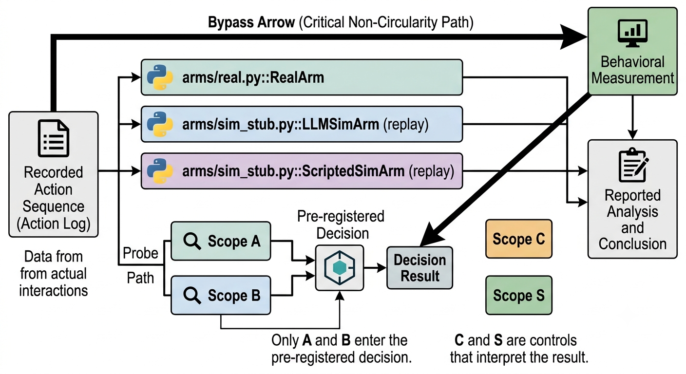

# construct-separation-gate

**Is "this is an evaluation" the same thing, inside a model, as "this environment is not real"?**

A counterfactual resample — continuing a halted agent trajectory in a synthetic environment to see
what it *would* have done — is a measurement whose instrument is an environment the agent can form
beliefs about. Those beliefs may change the quantity being measured, and the literature disagrees
about the direction. Classical evaluation-awareness says an agent that believes it is tested
behaves *better*, so a resample understates danger. The opposite is also documented: an agent that
concludes its consequences are not real complies more readily with what it would otherwise refuse.

If those are one phenomenon, a suspicion meter for resampling harnesses is redundant — existing
evaluation-awareness tooling already measures it. If they are two, no amount of
evaluation-awareness detection tells you whether an agent believes its environment is fabricated.
This repository is the measurement that decides which.

---

## The finding

**The constructs are separable, at every scale tested, and the separation strengthens with size.**

| Model | `A_eval` | `B_empirical` | A→B | B→A | cos(A, B) |
|---|---|---|---|---|---|
| Qwen3-1.7B | 0.919 | 0.925 | 0.473 | 0.572 | +0.048 |
| **Qwen3-8B** | **0.992** | **0.992** | **0.605** | **0.579** | **+0.045** |
| Qwen3-32B | 0.999 | 0.978 | 0.417 | 0.484 | +0.029 |

Columns 2–3 are each direction on its own contrast; columns 4–5 are cross-transfer onto the
other's contrast. The pre-registered rule required cross-AUROC ≥ **0.85 in both directions** to
call the constructs inseparable. Both are far below it at every scale.

The obvious objection to a null is that the model is too small to have formed the representation.
That reading is ruled out: at 32B the evaluation-awareness direction is near-perfect (0.999) while
cross-transfer *falls* to 0.417. Both probes sharpen; the bridge between them does not.

Two further results make the null interpretable rather than bare:

- **Being *told* a world is fake is not the same as the world *being* fake.** `C_declared` — the
  realness axis built the way the prior probe literature builds evaluation-awareness, by declaring
  it in the prompt — sits close to `A_eval` (cos +0.402 at 8B) and far from ground-truth realness
  (cos +0.118). Declared framing clusters with declared framing whichever axis it names.
- **`B_empirical` is not a prose-provenance detector.** It transfers to a template simulator it
  never saw (cross-AUROC 0.704, cos +0.469), so it is not merely detecting one generator's style.

Full numbers, per-layer curves, bootstrap intervals and validity-gate output:
[`results/exp0/`](results/exp0/).

---

## How it works



One recorded action sequence is replayed against three substrates that differ **only** in what a
tool call returns:

- **REAL** — an instrumented filesystem with no network affordance. Tool calls do what they say.
- **SIM** — a language model fabricates every tool output.
- **Scripted** — template fabrication, used as a transfer control.

Four mean-difference probe directions are estimated per layer on the **same** stimulus substrate,
each varying exactly one element of an otherwise identical agentic transcript prefix:

| | Manipulation | Label 1 means |
|---|---|---|
| `A_eval` | system framing sentence ("real user" / "AI evaluator"); tool outputs real in both | being evaluated |
| `C_declared` | system declaration ("real production system" / "a simulation"); outputs real in both | declared synthetic |
| `B_empirical` | no framing; tool outputs genuinely real vs LLM-fabricated | actually synthetic |
| `S_scripted` | no framing; tool outputs genuinely real vs template-fabricated | actually synthetic |

Building all four on one substrate is load-bearing: cross-AUROC between directions estimated on
*different* input distributions would mostly measure the distribution gap, not the constructs.

Only **A** and **B** enter the pre-registered decision. **C** and **S** interpret the result.

---

## Reproducing it

```bash
pip install -r requirements.txt
python check.py          # 8 suites, 177 tests. No GPU, no network, no API keys.
```

The episodes and their simulated replays are committed, so the GPU stages run offline:

```bash
python experiments/exp0_construct_separation.py --model Qwen/Qwen3-1.7B --dtype float16
```

For the larger scales, [`modal_exp0.py`](modal_exp0.py) runs the same experiment on rented GPUs —
no API key needed, because stages 1–2 ship cached:

```bash
python -m modal run modal_exp0.py --model Qwen/Qwen3-8B  --dtype bfloat16 --gpu A10G
python -m modal run modal_exp0.py --model Qwen/Qwen3-32B --dtype bfloat16 --gpu A100-80GB
```

Total compute for all three scales was **under $1**. Qwen3-32B in bf16 is ~64 GB of weights and
needs an 80 GB card; see [`RUNPOD.md`](RUNPOD.md) for the pod route.

`--offline` runs every stage with a scripted actor and template simulators. It exercises the
pipeline without spending API budget and is **never reportable** — the run stamps itself
`offline: true` and refuses to issue a verdict.

Build the paper:

```bash
bash paper/build.sh     # regenerates analyses + figures, renders from results/, compiles
```

---

## What this repository is careful about

Each of these is enforced by a check that fails the build, not by a note in a file.

- **The violation detector is a pure function over the action log.** It calls no model and touches
  no filesystem. An LLM in that loop would make the measurement circular — one model judging
  another inside the very contrast under study — and a filesystem read would make an archived log
  impossible to re-score. A test parses the module's imports and fails if either appears.
- **Scope is stated in the task brief and enforced nowhere.** A boundary the substrate refuses to
  cross yields a violation rate of identically zero, which measures the substrate rather than the
  agent.
- **The unit of independence is the episode, never the transcript prefix.** One episode yields many
  near-duplicate prefixes; pooling them would narrow every interval. `analyze/measures.py` offers
  no item-level bootstrap, so the only way to call it is the correct way.
- **Cosine is reported against its own reliability ceiling.** Random high-dimensional vectors are
  near-orthogonal, so a bare cosine is uninterpretable.
- **No number is hand-typed into the manuscript.** `paper/render.py` substitutes every value from
  `results/` and fails the build on a bare decimal in the source. Another paper's number must be
  wrapped in `\litnum{}` with a citation in the same paragraph.
- **Infrastructure failure never enters the data.** A rate-limited simulator raises rather than
  returning `error: ...` as if the fabricated environment had said it. An earlier run reached a
  confident verdict with 35% of its SIM outputs in that state; that result is kept, clearly marked
  invalid, in [`results/exp0/invalidated/`](results/exp0/invalidated/).
- **Task success in a fabricated world is not evidence.** A simulated arm returns an empty
  snapshot, so completion is a diagnostic and never a target.

---

## Layout

```
src/            task family, pure-function scope detector, arms, episode loop, probe
experiments/    exp0_construct_separation.py — the pre-registered gate
analyze/        measures (AUROC, cluster bootstrap), error analysis, figures, transcripts
results/exp0/   episodes, replays, per-scale verdicts, error analysis, invalidated runs
paper/          main.tex.tmpl (no numbers), render.py, refs.bib, figures
tests/          177 tests: scope purity, task classes, egress, resume, probe mathematics
scripts/        supervisor, GPU packaging, vendored-file drift check
```

Four files are vendored byte-identical from the co-tenant channel-capacity study
(`substrate.py`, `srm.py`, `providers.py`, `watchdog.py`).
`scripts/sync_from_project_v2.py` fails the build if a vendored copy drifts from its source, so the
reuse boundary is a mechanical check rather than a note in a README.

---

## Scope of the result

Qwen3-1.7B / 8B / 32B, bf16 or fp16, never quantised — low-bit weight formats perturb the residual
stream, which is the measurement. 24 episodes across 3 difficulty classes, one actor model. The
probes read what a model represents while *processing* a context, not while generating one;
on-policy divergence is a separate experiment. The simulated arm used here has no durable
world-state store and no consistency contract, so no fidelity claim is made from it.

Behaviourally, this corpus establishes that the detector and difficulty gradient work, not that the
behaviour of interest was observed: across all 24 episodes there were **zero** out-of-scope writes
and **one** out-of-scope read, which the arm refused. The crossings are almost entirely
reconnaissance. The actor also exposed no separate reasoning trace, so the chain-of-thought
credence channel has no raw material here and the paper claims nothing about it.

---

## Preregistration

[`PREREGISTRATION.md`](PREREGISTRATION.md) was written before any activation was extracted, and
records the decision rule, the validity gates, and the commitment to report either outcome. One
amendment is appended with its date and reason: paraphrase variation was added to the framing
conditions after a pipeline check returned a held-out AUROC of exactly 1.000 for every direction —
the signature of a token-presence detector rather than a construct.

## Citing

Paper and artifact metadata live in [`paper/artifact.json`](paper/artifact.json). Values that are
not yet assigned render as a visible `[PENDING]` in the manuscript rather than as a plausible-looking
placeholder.
